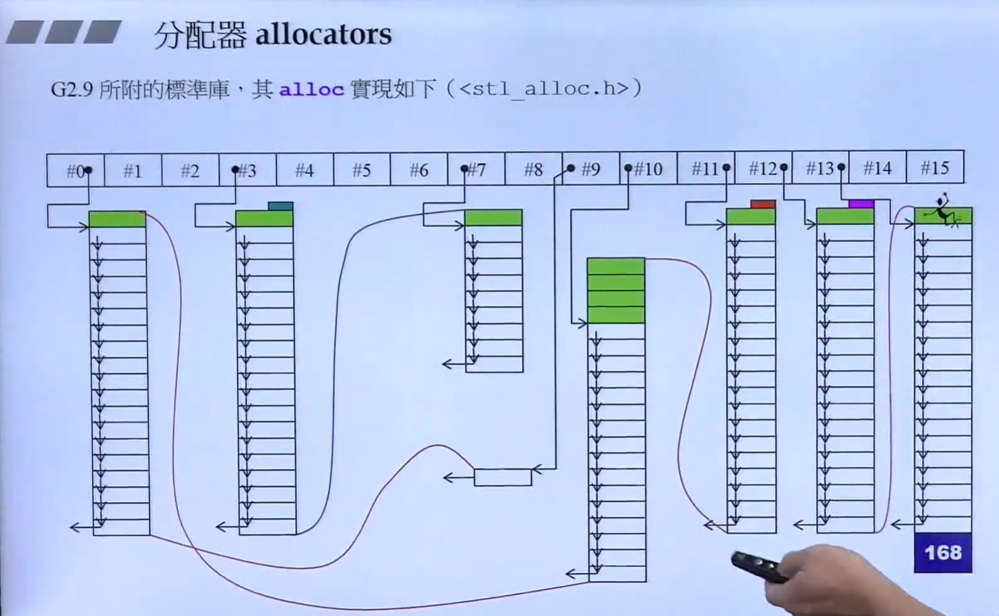

# allocator
## new和free

在C++调用new会调用C的malloc函数，malloc函数根据程序所在的系统环境调用不同的系统接口（Linux\Win\Unix）.
malloc 分配的内存中会附带overhead(某些固定大小的内存块用来存放其他必要信息).
由于overhead大小是固定的，因此一次性申请较大的空间，其overhead占比就比较小.
若分多次申请小空间，其overhead占比就比较大.

## overhead

overhead中记录了当前内存块的大小。能够发现，在实际的使用中，free函数只需要接收一个指针，而不需要知道这块内存到底有多大。
实际上，overhead中的cookie记录了这部分数据，当free接收到了指针，会去找cookie部分以获取数据块的大小。

## vc6/vc2014/Borland C++/GNU C(defalloc)中allocator的实现就是调用了new\free

因此如果利用VC6的容器存放较小的元素类型，极有可能造成overhead所占容量多于元素所占容量的情况(实际上现实中大多数情况下都是overhead大于元素),并且调用封装版的malloc效率并不如直接调用malloc.

*实际上在GNUC版本中，从不使用这个allocator.*

由于STL中容器的各个元素大小都相同，因此解决这一问题的最佳途径是——*减少对malloc的调用次数。*

## GNUC2.9中实际的Allocator结构

GNUC2.9中设有两级内存配置器。

第一级配置器负责两种情况:
1. 配置区块容量超过128Byte的请求->调用malloc(),因为元素size足够大，因此overhead所占比例较小。
2. 当前可用空间不足以满足请求->调用set_new_handler().

第二级配置器负责8-128Byte请求:
1. 采用Memory pool整理，用区块+指针串连管理空间，使用union关键字以节省空间.

当接收到内存分配请求时，配置器从Memory pool中分配满足当前请求大小(如果不为8的倍数，则向上取8的整数倍)的内存块。
Memory pool每次Malloc一个链表长度的内存块，由于只调用了一次malloc，因此只产生一次overhead信息。


## GNUC4.9

然而在GNUC4.9版本中又采用了malloc和free版本的allocator.并且GNUC2.9的Allocator被指定为扩充版的pool-allocator.

# STL中使用仿函数

在C语言中，想要将函数作为参数传递，只能将函数指针作为参数传递
```C++
bool cmp(const void* elem1, const void* elem2);

void main()
{
    int ia[4] = {32, 92, 67, 58};

    qsort(ia,sizeof(ia)/sizeof(int),sizeof(int),cmp);//传递cmp指针，作为排序的策略
}
```
但是函数指针无法持有自己的状态，以及无法加另外的条件对函数进行修饰。  
于是在STL中采用仿函数(functor),所谓仿函数就是用起来像函数的东西。其本质是对括号()运算符进行重载。
```C++
template <typename T>
class max{
    public:
    T operator()(const T& elem1, const T& elem2)
    {
        if(elem1 > elem2) return elem1;
        else return elem2;
    }
};

int main()
{
    std::cout<<max<int>()(1 ,2)<<std::endl;// return 2
    getchar();
    return 0;
}
```

# Traits 编程技法
## 问题背景
迭代器所指对象的类型一般被声明typedef为value_type,如此做可以将value_type作为函数的返回类型。  
```C++
template <class _Ty>
class array{
   typedef  _Ty value_type;
}
```
问题是当Iterator是一个自定义class时，我们可以很方便地使用value_type,如
```C++
array::value_type val;
```
但是如果Iterator是C++自定义地五种基本类型的指针(int*\float*等)，那么这时候该如何使用value_type?

## 通过Traits萃取出所需的associated type
Iterator traits(萃取机)用来分离class iterator和 非class iterator。  
需要注意的是，对于非class iterator，其value_type 也十分明显。
```C++
// 以int*为例，其value_type就是int
int* a;// 实际上Iterator是一种泛化的指针，所以指针也算是一种iterator
```
## 简单的Traits例子
```C++
template<class T>
struct iterator_traits{
    // T::value_type即是调用T的类内自定义类型
    typedef typename T::value_type valuetype;
}

template<class T>
// 通过template偏特化实现
struct iterator_traits<T*>{
    // T本身就是类型
    typedef T value_type;
}

template<class T>
struct iterator_traits<const T*>{
    typedef T value_type;
}
```
## 结论
以上，算法在拿到任意一个iterator时，就可以直接通过萃取机直接使用其类型。

